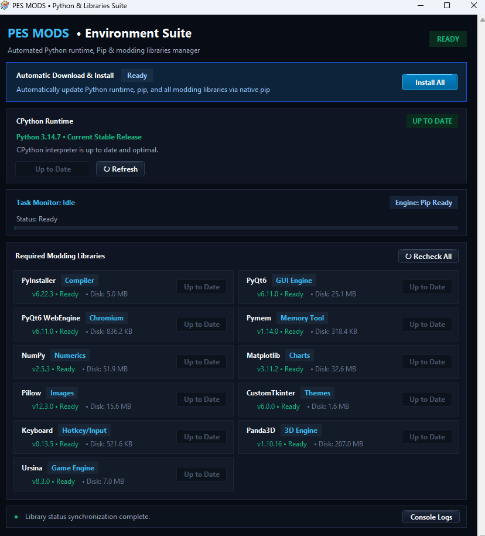

# ⚽ VAR-Mods-2026: Next-Gen Broadcast & Analytics Suite


[](https://opensource.org/licenses/MIT)
[](https://www.python.org/)
[](https://www.pessmohaned.com/)

An advanced, unified Python-driven overlay and live match analytics suite built specifically for **Football Life 2026** (PES 2021 engine). 

**VAR-Mods-2026** bridges low-level RAM memory inspection with real-time dynamic graphics rendering, delivering modern VAR, broadcast camera dynamics, and tactical telemetry straight into your gameplay experience.

---

## 📌 Table of Contents
- [Why a Unified Suite?](#-why-a-unified-suite)
- [Architecture & Workflow](#-architecture--workflow)
- [Detailed Module Breakdown](#-detailed-module-breakdown)
- [Automatic Dependency Manager](#-automatic-dependency-manager)
- [Game Settings & Requirements](#-game-settings--requirements)
- [Installation & Setup](#-installation--setup)
- [How to Run](#-how-to-run)
- [Troubleshooting & FAQ](#-troubleshooting--faq)
- [Development Story & AI Integration](#-development-story--ai-integration)
- [Community Call to Action](#-community-call-to-action)
- [License](#-license)

---

## 💡 Why a Unified Suite?

In traditional modding, running multiple standalone Python scripts or memory hooks simultaneously leads to severe memory address collision, resource hogging, and frequent game crashes. 

**VAR-Mods-2026** resolves this by consolidating all broadcast utilities into a single synchronized core engine. This unified approach:
- Eliminates RAM offset read conflicts.
- Reduces CPU/GPU overhead by sharing frame rendering cycles.
- Allows on-the-fly toggling and live configuration without closing the game.

---

## 🏗️ Architecture & Workflow

The system is engineered using a two-tier decoupled architecture:

![System Architecture]

1. **Mother Application (`MyMods.py`):**
   * A full-featured GUI built with PyQt for customizing options, hotkeys, and individual mod behaviors.
   * Includes built-in quick instructions per mod and quick-access buttons to full YouTube video tutorials.
2. **Bridge Engine (`ModBridge.py`):**
   * A high-performance, background memory engine that performs non-invasive hook operations and draws transparent overlay overlays over the game.
   * Enables in-game keybinding triggers to toggle mods live during match play.

---

## 💻 Detailed Module Breakdown

### 1. 📐 SAOT Mod (Semi-Automated Offside Technology)
Generates dynamic 3D offside lines in real-time by reading 3D spatial coordinates of players and the ball directly from RAM.


### 2. 🥅 GLT Mod (Goal-Line Technology)
High-precision goal-line decision overlay featuring instant frame-freeze and 3D goal-plane inspection angles.


### 3. 🔥 HeatMap Mod
Renders tactical positional influence heatmaps live during matches to analyze team pressure and spatial control.


### 4. 🎥 RefereeView Mod
Provides an immersive body-cam perspective overlay simulating top-flight referee broadcasting views.


### 5. 📈 MomentumMatch Mod
Calculates real-time match dominance, momentum swings, and pressure indices using tactical data streams.


---

## 🛠️ Automatic Dependency Manager

The suite includes an automated environment installer (`Python Library Downloader.exe` / `Python Library Downloader.py`) designed to automatically inspect, download, and sync your CPython runtime alongside all required libraries[cite: 1].



### Core Required Libraries[cite: 1]:
* **GUI Engine:** `CustomTkinter`, `PyQt6`, `PyQt6-WebEngine`[cite: 1]
* **3D & Game Engines:** `Panda3D`, `Ursina`[cite: 1]
* **Memory & Input:** `PyMem`, `Keyboard`[cite: 1]
* **Numerics & Imaging:** `NumPy`, `Matplotlib`, `Pillow`[cite: 1]
* **Build Tools:** `PyInstaller`[cite: 1]

---

## ⚠️ Game Settings & Requirements

* **Target Game:** Football Life 2026 (PES 2021 base engine).
* **Display Requirement:** The game **MUST** be run in **Borderless Windowed** mode in your game settings for transparent overlays to render correctly over the match window.

---

## 🚀 Installation & Setup

### Option A: Automated Setup (Recommended)
1. Run `Python Library Downloader.exe` (or execute `python "Python Library Downloader.py"`).
2. Click **Install All** to automatically set up Python and all requisite dependencies[cite: 1].

### Option B: Manual Installation (Developers)
Clone this repository and install dependencies using `requirements.txt`:

```bash
git clone [https://github.com/miladeazkat-maker/VAR-Mods-2026.git](https://github.com/YourUsername/VAR-Mods-2026.git)
cd VAR-Mods-2026
pip install -r requirements.txt

```

#### `requirements.txt`

```text
customtkinter
keyboard
matplotlib
numpy
panda3d
pillow
pymem
pyqt6
pyqt6-webengine
ursina

```

---

## 🎮 How to Run

1. **Configure Mods:** Launch the Mother GUI to set up options and custom hotkeys:
```bash
python MyMods.py

```


2. **Start the Bridge Engine:** Click the **Launch Bridge** button in the app or run:
```bash
python ModBridge.py

```


3. **Launch the Game:** Open **Football Life 2026** in **Borderless Windowed** mode.
4. **Play:** Use your assigned hotkeys during the match to trigger VAR overlays, heatmaps, or GLT reviews!

---

## ❓ Troubleshooting & FAQ

---

## 🤖 Development Story & AI Integration

This project is the result of over **5 months of intensive research and engineering**, with approximately **80% of the architecture code-assisted by cutting-edge AI models**. It serves as an open testbed for AI-assisted reverse engineering, real-time memory injection, and computer graphics overlays in sports video games.

Many more features and brand-new mods are actively under development!

---

## 🤝 Community Call to Action

### 🎮 To Gamers & Football Fans:

* **Test & Feedback:** Try the suite in your career modes and matches!
* **Report Bugs:** Open an issue if you encounter crashes or offset glitches.
* **Support:** Consider donating to support future development and server costs for asset updates.

### 💻 To Developers & Modders:

* **Contribute Offsets:** Help maintain RAM memory addresses across game patches.
* **Build Real VAR:** Join forces with us to build a fully automated, functional Video Assistant Referee system!
* **Open-Source Ethos:** We advocate for open modding. If you fork or build upon this project, please keep your creations **100% free and open-source** for everyone.

---

## 📜 License

Distributed under the **MIT License**. See `LICENSE` for more informatn.
