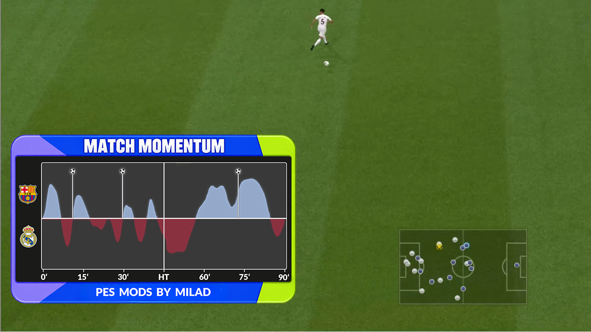
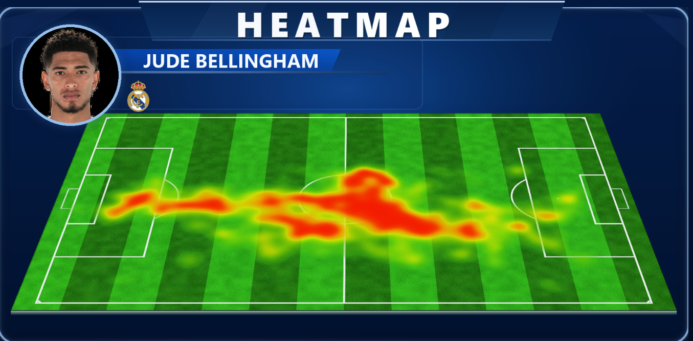
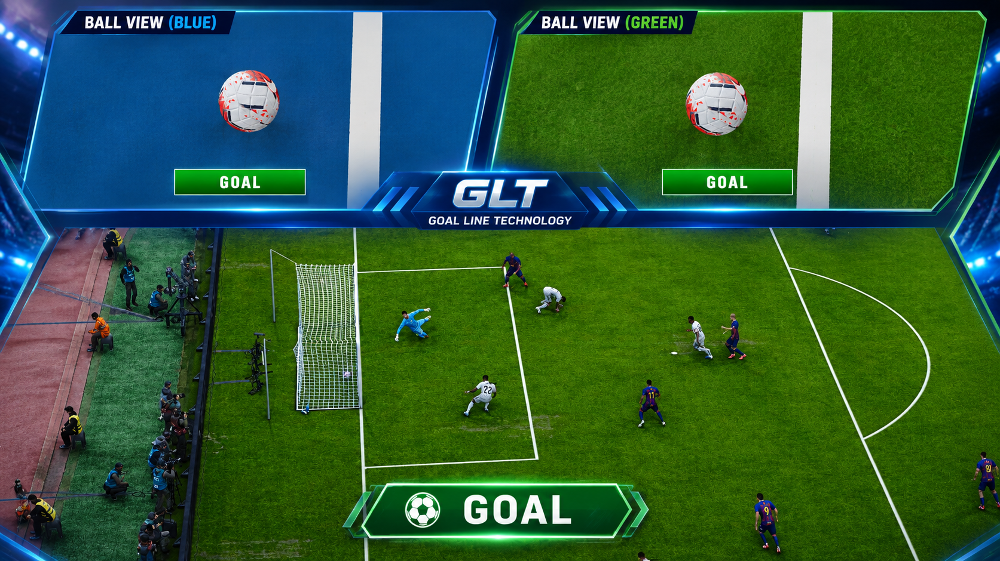
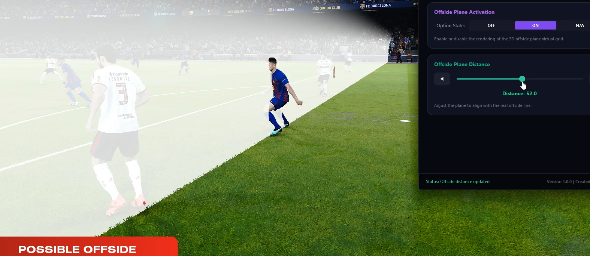
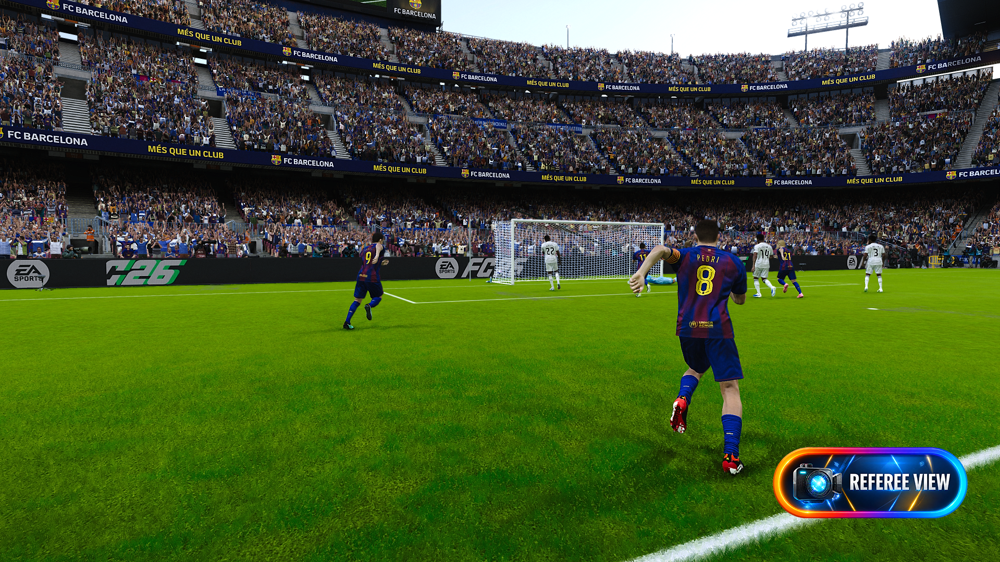

# ⚽ VAR-Mods-2026

A Python-based broadcast, VAR, camera, and match-analysis suite for Football Life 2026.

VAR-Mods-2026 combines game-memory telemetry, real-time overlays, broadcast-style rendering, and configurable mod backends. The project is designed around a frontend/bridge/backend architecture so that the user interface, shared hook broker, and individual gameplay tools can evolve independently.

> **Target:** Football Life 2026 (PES 2021-based engine)  
> **Platform:** Windows  
> **License:** MIT

## 🧩 1. Project Components

The repository currently contains the following user-facing modules:

| Module | Purpose |
|---|---|
| **S.A.O.T.** | Semi-Automated Offside Technology with live player/ball positioning and an offside-plane visualization workflow. |
| **Goal Line Technology** | Goal-line review workflow with replay control, camera views, frame freezing, and configurable animation controls. |
| **Referee View** | Referee-perspective camera/overlay functionality. |
| **Match Momentum** | Live event detection, pass/shot analysis, possession tracking, momentum scoring, broadcast chart rendering, and timed chart overlays. |
| **Heat Map** | Live player-position collection, tactical heatmap generation, broadcast rendering, and player/team presentation. |
| **Asset Downloader** | Downloads and manages Football Life/PES player and team assets used by the presentation layers. |

The desktop frontend is responsible for configuration and launching the bridge. Individual backends are responsible for their own runtime logic.

## 🏗️ 2. Runtime Architecture

The project uses three logical layers.

### 🖥️ 2.1 Frontend — MyMods.py

MyMods.py is the main configuration application.

It provides:

- Mod configuration and hotkey management.
- Preview panels and usage instructions.
- ModsConfig.json generation/update.
- Team and presentation settings.
- Launch control for the bridge layer.
- Configuration passed to backend processes.

### 🔗 2.2 Bridge — ModBridge.py

ModBridge.py is the middle layer between the frontend and the individual mod backends.

Its responsibilities include:

- Starting and monitoring backend processes.
- Running privileged components where required.
- Providing the shared hook broker.
- Managing hook ownership and coexistence between mods.
- Passing configuration to child processes.
- Monitoring backend lifecycle and failures.
- Providing IPC through the local bridge channel.

The bridge is especially important for shared game-memory hooks. A backend should not blindly restore bytes that may belong to another active consumer.

### ⚙️ 2.3 Mod Backends

Each mod has its own backend implementation and assets.

    VAR-Mods-2026/
    ├── MyMods.py
    ├── ModBridge.py
    ├── Python_Library_Downloader.py
    ├── MomentumMatch/
    │   ├── MomentumMod.py
    │   ├── modules/
    │   │   ├── 01_runtime.py
    │   │   ├── 02_memory.py
    │   │   ├── 03_models.py
    │   │   ├── 04_engines.py
    │   │   ├── 05_chart_tv.py
    │   │   ├── 06_snapshot_core.py
    │   │   ├── 07_overlay_renderers.py
    │   │   ├── 08_scene_archive.py
    │   │   ├── 09_team_identity.py
    │   │   ├── 10_app_gui_snapshot.py
    │   │   └── 12_selftest_entry.py
    │   └── tex/
    ├── HeatMap/
    │   ├── HeatMapMod.py
    │   └── BroadcastRenderer.py
    ├── GLT/
    │   ├── GLTMod.py
    │   └── tex/
    ├── SAOTMod/
    │   ├── SAOTMod.py
    │   └── textut/
    ├── RefereeView/
    │   └── RefereeView.py
    ├── PT/
    │   └── PES_FootballLife_Asset_Downloader.py
    ├── Background/
    ├── assets/
    ├── requirements.txt
    └── LICENSE

## 📊 3. Match Momentum

MomentumMatch/MomentumMod.py is the backend for Match Momentum.

The original implementation grew into a single source file of more than 22,000 lines. It contained memory access, event models, pass and shot analysis, momentum scoring, TV chart generation, snapshot management, GPU/Win32 overlay renderers, team identity handling, GUI/runtime orchestration, and self-tests.

The implementation is being modularized without changing its runtime contract. The refactor is verified in CI by comparing the normalized abstract syntax tree of the modular source against the original monolith.

  

### 🧩 3.1 Momentum Modules

| File | Responsibility |
|---|---|
| 01_runtime.py | Runtime bootstrap, PT data source, platform handling, shared configuration, and low-level startup utilities. |
| 02_memory.py | Windows memory access, game hooks, hook broker communication, and GameEngine. |
| 03_models.py | Data models, runtime state, event structures, and shared event infrastructure. |
| 04_engines.py | Pass, shot, pressure, transition, event-detection, and momentum engines. |
| 05_chart_tv.py | Momentum chart generation, TV timeline processing, smoothing, markers, and presentation calculations. |
| 06_snapshot_core.py | Snapshot configuration and transactional snapshot state management. |
| 07_overlay_renderers.py | GPU and Win32 overlay renderers. |
| 08_scene_archive.py | GPU scene construction, match archives, archive loading, and archive rendering. |
| 09_team_identity.py | Team detection, team colors, logos, player identity, and related presentation data. |
| 10_app_gui_snapshot.py | MomentumApp UI, snapshot presentation, live monitoring, event polling, match lifecycle, reset handling, and runtime orchestration. |
| 12_selftest_entry.py | Regression/self-test suite and the public main() entry point. |

MomentumMod.py remains the public entry point. The modular files are loaded in their original dependency order into the same runtime namespace. This preserves the existing public names and avoids introducing unnecessary import cycles into the memory-hook and rendering code.

### 🔄 3.2 Momentum Data Pipeline

The Momentum backend combines several data sources:

- Match clock.
- Possession state.
- Ball position.
- Player positions.
- Pass counter/events.
- Shot counter/events.
- Goal counters.
- Red-card state.
- Team identity and colors.
- Player/team assets.

These inputs feed the event-detection and scoring engines, which produce the momentum history used by the standard chart and the TV-style renderer.

### ⚽ 3.3 Match Events

The event system currently includes logic for:

- Successful and failed passes.
- Pass threat.
- Shot detection and classification.
- Shot threat.
- Chances and big chances.
- Goals and goal response.
- Penalties and penalty outcomes.
- Pressure episodes.
- Transitions.
- Counterattacks.
- Line breaks.
- Final-third entries.
- Penalty-box entries.
- Corners.
- Goal kicks.
- Red-card markers.
- Possession changes.

The scoring layer applies configurable weights and time-based decay rather than treating every event as an identical contribution.

### 📺 3.4 Snapshot and Broadcast Presentation

Momentum snapshots support:

- Half-time snapshots.
- Second-half snapshots.
- Extra-time snapshots.
- End-of-match snapshots.
- Configurable display duration.
- Preloading.
- Transactional show/confirm/fail states.
- Automatic retry after failed presentation.
- GPU rendering when available.
- Win32 fallback rendering.
- Optional permanent match-chart archives.

The renderer also supports the TV-style timeline with half-time, full-time, extra-time, goal, and red-card markers.

## 🌡️ 4. Heat Map

The Heat Map backend separates data acquisition from presentation.

HeatMapMod.py handles:

- FL 2026 process access.
- Player-position acquisition.
- Ball and match-time data.
- Team/player identification.
- Match lifecycle handling.
- Heatmap generation.
- Overlay control.

BroadcastRenderer.py handles the GPU presentation layer and broadcast-style animation.

The renderer follows a shared coordinate contract so that the live 2D heatmap and broadcast presentation remain spatially consistent.

  

## 🥅 5. Goal Line Technology

The GLT backend provides the goal-line review workflow, including:

- Goal-review state handling.
- Game-memory interaction.
- Replay/camera control.
- Goal-plane inspection.
- Configurable animation controls.
- Multiple presentation styles.

GLT runs independently from the Momentum backend while participating in the bridge's hook-coexistence architecture where shared memory locations are involved.

  

## 📐 6. S.A.O.T.

The S.A.O.T. module provides a semi-automated offside visualization system based on live game coordinates.

Its package also contains the ReShade assets required by the S.A.O.T. workflow.

  

## 🎥 7. Referee View

Referee View provides a dedicated referee-perspective presentation layer.

The module includes its preview and overlay assets and is launched and monitored through the bridge architecture.

  

## 📦 8. PT Data and Assets

The project uses the PT data source for team/player identity and presentation assets.

The shared PT data model can provide:

- Team IDs.
- Team names.
- Short names.
- Team colors.
- Player slots.
- PES player IDs.
- Team logos.
- Player face images.

Asset extraction is designed to avoid unpacking the complete asset archive when only a single image is required.

## 🛠️ 9. Installation

### 📚 Required Python Packages

The runtime dependencies are maintained in `requirements.txt`. The current suite requires:

| Package | Role |
|---|---|
| `customtkinter` | Themed UI components used by the desktop tools. |
| `keyboard` | Global hotkey/input handling. |
| `matplotlib` | Chart generation and offline rendering. |
| `moderngl` | Modern OpenGL GPU rendering. |
| `glfw` | OpenGL context and overlay-window management. |
| `numpy` | Numerical processing and telemetry calculations. |
| `panda3d` | 3D/game rendering support used by project components. |
| `pillow` | Image processing and asset preparation. |
| `pymem` | Windows process-memory access support. |
| `pyqt6` | Main desktop GUI framework. |
| `pyqt6-webengine` | Embedded web content support. |
| `ursina` | 3D/game-engine support used by project components. |

### 📥 Automated Installation

The repository includes:

- Python_Library_Downloader.py
- Python Library Downloader.exe

The downloader is intended to install the Python runtime dependencies used by the suite. Its package list is kept in sync with requirements.txt.

### 💻 Manual Installation

Install Python and the dependencies listed in requirements.txt.

    git clone https://github.com/miladeazkat-maker/VAR-Mods-2026.git
    cd VAR-Mods-2026
    pip install -r requirements.txt

## 🎮 10. Running the Suite

The normal workflow is:

1. Start MyMods.py.
2. Configure the required mods and hotkeys.
3. Launch ModBridge.py from the frontend.
4. Start Football Life 2026.
5. Enable/use the desired mod according to its configuration and hotkey.
6. Keep the game in a window mode compatible with the overlay system.

Individual backends also expose development/testing entry points where applicable.

For Match Momentum:

    python MomentumMatch/MomentumMod.py --selftest

An archived Momentum match can also be rendered without running a live match:

    python MomentumMatch/MomentumMod.py --render-archive <archive.zip|match_data.json>

## 🧪 11. Development and Safety Rules

Because several components interact directly with the game's process memory, refactoring must preserve behavior.

When modifying a backend:

- Do not change memory offsets unless the change is intentional and documented.
- Do not change hook signatures or original instruction bytes accidentally.
- Do not restore memory owned by another active hook consumer.
- Preserve match lifecycle transitions.
- Preserve fallback paths.
- Preserve timing-sensitive worker behavior.
- Preserve the public entry point used by ModBridge.py.
- Run the available self-tests after changes.
- Prefer small, reviewable commits over large unrelated changes.

For the Momentum refactor specifically, module boundaries should remain based on responsibility. Do not split a timing-sensitive state machine merely to reduce line count.

## 🚀 12. Project Status

VAR-Mods-2026 is an actively developed modding project. Some components contain legacy compatibility paths because the project has evolved through multiple generations of the underlying tools.

The current development focus includes:

- Improving maintainability of the large Momentum backend.
- Removing obsolete implementation debris and unnecessary comments.
- Standardizing source documentation in English.
- Keeping the runtime behavior and existing gameplay integrations stable.
- Improving the public project documentation.

## 🤝 13. Contributing

Bug reports, compatibility information, reverse-engineering findings, and carefully tested improvements are welcome.

When reporting a memory-related issue, include:

- Football Life version.
- Which mod was active.
- Whether the bridge was running.
- Whether another memory-intensive mod was active.
- The relevant backend log/self-test result.
- The exact reproduction steps.

## 📜 14. License

This project is distributed under the MIT License. See LICENSE for the complete license text.
