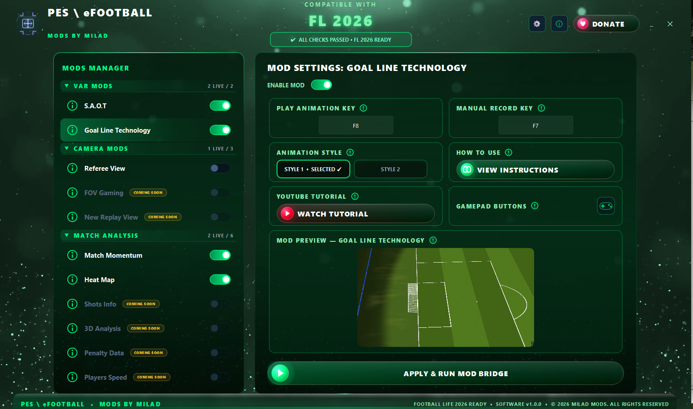

# ⚽ VAR-Mods-2026 — Next-Gen Broadcast & Analytics Suite for Football Life 2026\n\n
\n  \n
\n\n
\n  \n  \n  \n
\n\nVAR-Mods-2026 is an advanced Python-driven broadcast, VAR, camera, and live match-analysis suite built specifically for **Football Life 2026** (PES 2021-based engine).\n\nThe project combines low-level game-memory telemetry with real-time graphics, broadcast-style overlays, match analysis, and presentation tools — bringing a more authentic TV-production feel directly into gameplay.\n\n---\n\n## 🎯 What Is VAR-Mods-2026?\n\nVAR-Mods-2026 brings several independent tools together through a shared **Frontend → Bridge → Backend** architecture.\n\nThe goal is simple: create a modding environment where multiple systems can work side-by-side without unnecessarily duplicating memory access, configuration, rendering work, or process management.\n\n### 🧩 Main Components\n\n| Module | Purpose |\n|---|---|\n| **S.A.O.T.** | Semi-Automated Offside Technology using live player/ball coordinates and offside-plane visualization. |\n| **Goal Line Technology** | Goal-line review workflow with replay control, camera views, frame freezing, and configurable presentation. |\n| **Referee View** | Referee-perspective camera and broadcast presentation. |\n| **Match Momentum** | Live event detection, pass/shot analysis, possession tracking, momentum scoring, and broadcast chart rendering. |\n| **Heat Map** | Live player-position collection, tactical heatmaps, and broadcast presentation. |\n| **Asset Downloader** | Team/player asset discovery and download support for the presentation layers. |\n\n---\n\n## 🏗️ Architecture\n\nThe project is organized into three logical layers.\n\n### 🖥️ 1. Frontend — MyMods.py\n\nThe main desktop application handles:\n\n- Mod configuration.\n- Hotkeys and controls.\n- Team and presentation settings.\n- Preview panels and instructions.\n- ModsConfig.json generation/update.\n- Launching and communicating with the bridge.\n\n### 🔗 2. Bridge — ModBridge.py\n\nThe bridge connects the frontend to the mod backends and coordinates shared runtime resources.\n\nIt is responsible for:\n\n- Starting and monitoring backend processes.\n- Passing configuration to child processes.\n- Managing shared memory-hook ownership.\n- Coordinating coexistence between mods.\n- Running privileged components where required.\n- Monitoring backend lifecycle and failures.\n- Providing the local IPC/bridge channel.\n\n### ⚙️ 3. Mod Backends\n\nEach mod keeps its own runtime logic and assets while participating in the shared project architecture.\n\n---\n\n# 🎥 Mod Previews\n\n## 📐 S.A.O.T. — Semi-Automated Offside Technology\n\nReal-time offside-plane visualization based on live player and ball positions.\n\n
\n  \n
\n\n---\n\n## 🥅 Goal Line Technology\n\nA goal-line review workflow with replay control, frame freezing, and dedicated goal-plane presentation.\n\n
\n  \n
\n\n---\n\n## 🔥 Heat Map\n\nLive tactical positioning and spatial-pressure visualization built from in-game player telemetry.\n\n
\n  \n
\n\n---\n\n## 🎥 Referee View\n\nA dedicated referee-perspective presentation layer designed to recreate the feel of modern football broadcasts.\n\n
\n  \n
\n\n---\n\n## 📈 Match Momentum\n\nReal-time match momentum analysis with event detection, pressure tracking, scoring logic, and TV-style timeline presentation.\n\n
\n  \n
\n\n---\n\n# 📊 Match Momentum\n\nMomentumMatch/MomentumMod.py was originally a single backend containing more than **22,000 lines** of code.\n\nIt combined memory access, game hooks, event models, pass and shot analysis, momentum scoring, TV chart generation, snapshot management, GPU/Win32 rendering, team identity, GUI/runtime orchestration, and regression tests.\n\nThe backend is now organized into smaller responsibility-based modules without changing its runtime contract.\n\n### Momentum Module Layout\n\n| File | Responsibility |\n|---|---|\n| 01_runtime.py | Runtime bootstrap, PT data source, platform handling, and startup utilities. |\n| 02_memory.py | Windows memory access, game hooks, hook broker communication, and GameEngine. |\n| 03_models.py | Shared models, runtime state, event structures, and event infrastructure. |\n| 04_engines.py | Pass, shot, pressure, transition, event-detection, and momentum engines. |\n| 05_chart_tv.py | Momentum charts, TV timeline processing, smoothing, markers, and presentation calculations. |\n| 06_snapshot_core.py | Snapshot configuration and transactional snapshot state. |\n| 07_overlay_renderers.py | GPU and Win32 overlay renderers. |\n| 08_scene_archive.py | GPU scene construction, match archives, archive loading, and archive rendering. |\n| 09_team_identity.py | Team detection, colors, logos, player identity, and presentation data. |\n| 10_app_gui_snapshot.py | MomentumApp, GUI, snapshot presentation, event polling, match lifecycle, and runtime orchestration. |\n| 12_selftest_entry.py | Regression/self-test suite and the public main() entry point. |\n\nMomentumMod.py remains the public entry point and loads the modules in dependency order into the same runtime namespace. This keeps the existing public names and avoids unnecessary import cycles in timing-sensitive memory and rendering code.\n\n### Momentum Data Pipeline\n\nThe backend can combine:\n\n- Match clock.\n- Possession state.\n- Ball position.\n- Player positions.\n- Pass counters/events.\n- Shot counters/events.\n- Goal counters.\n- Red-card state.\n- Team identity and colors.\n- Player/team assets.\n\nThese sources feed the event-detection and momentum-scoring layers, which produce the match history shown by the standard and TV-style renderers.\n\n### Match Events\n\nThe event system contains logic for:\n\n- Successful and failed passes.\n- Pass threat.\n- Shot detection and classification.\n- Shot threat.\n- Chances and big chances.\n- Goals and goal response.\n- Penalties and penalty outcomes.\n- Pressure episodes.\n- Transitions and counterattacks.\n- Line breaks.\n- Final-third entries.\n- Penalty-box entries.\n- Corners and goal kicks.\n- Red-card markers.\n- Possession changes.\n\n---\n\n# 🌡️ Heat Map\n\nHeatMapMod.py handles live game access, player-position acquisition, ball and match-time data, team/player identification, match lifecycle, heatmap generation, and overlay control.\n\nBroadcastRenderer.py provides the GPU presentation and broadcast-style animation layer.\n\nThe live heatmap and presentation renderer follow a shared coordinate contract so spatial data remains consistent between gameplay telemetry and the rendered broadcast scene.\n\n---\n\n# 🥅 Goal Line Technology\n\nThe GLT backend provides:\n\n- Goal-review state handling.\n- Game-memory interaction.\n- Replay/camera control.\n- Goal-plane inspection.\n- Configurable animation controls.\n- Multiple presentation styles.\n\nGLT operates independently from Match Momentum while respecting the project's shared hook-coexistence architecture where memory locations overlap.\n\n---\n\n# 📐 S.A.O.T.\n\nS.A.O.T. provides semi-automated offside visualization using live game coordinates.\n\nIts package also includes the ReShade assets required by the workflow.\n\n---\n\n# 🎥 Referee View\n\nReferee View provides a dedicated referee-perspective presentation layer with its own runtime assets and bridge-managed lifecycle.\n\n---\n\n# 📦 PT Data & Assets\n\nThe project uses the PT data source for team/player identity and presentation assets.\n\nAvailable presentation data can include:\n\n- Team IDs and names.\n- Short names.\n- Team colors.\n- Player slots.\n- PES player IDs.\n- Team logos.\n- Player face images.\n\nAsset extraction is designed to retrieve only the required image rather than unpacking the complete asset archive.\n\n---\n\n# 🛠️ Installation\n\n## Required Python Packages\n\nThe current runtime dependencies are maintained in requirements.txt.\n\n| Package | Role |\n|---|---|\n| customtkinter | Themed desktop UI components. |\n| keyboard | Global hotkey and input handling. |\n| matplotlib | Chart generation and rendering. |\n| moderngl | Modern OpenGL GPU rendering. |\n| glfw | OpenGL context and overlay-window management. |\n| numpy | Numerical processing and telemetry calculations. |\n| panda3d | 3D/game rendering support. |\n| pillow | Image processing and asset preparation. |\n| pymem | Windows process-memory access. |\n| pyqt6 | Desktop GUI framework. |\n| pyqt6-webengine | Embedded web-content support. |\n| ursina | 3D/game-engine support. |\n\n### Automated Installation\n\nThe repository includes:\n\n- Python_Library_Downloader.py\n- Python Library Downloader.exe\n\nThe downloader installs the Python runtime dependencies used by the suite, and its package list is kept in sync with requirements.txt.\n\n### Manual Installation\n\nInstall Python and the packages listed in requirements.txt:\n\n~~~bash\ngit clone https://github.com/miladeazkat-maker/VAR-Mods-2026.git\ncd VAR-Mods-2026\npip install -r requirements.txt\n~~~\n\n---\n\n# 🎮 Running the Suite\n\nThe normal workflow is:\n\n1. Start MyMods.py.\n2. Configure the desired mods and hotkeys.\n3. Launch ModBridge.py from the frontend.\n4. Start Football Life 2026.\n5. Enable the desired mod according to its configuration and hotkey.\n6. Keep the game in a window mode compatible with the overlay system.\n\n### Match Momentum Self-Test\n\n~~~bash\npython MomentumMatch/MomentumMod.py --selftest\n~~~\n\n### Render an Archived Momentum Match\n\n~~~bash\npython MomentumMatch/MomentumMod.py --render-archive <archive.zip|match_data.json>\n~~~\n\n---\n\n# ⚠️ Game Settings\n\nFor transparent overlays to render correctly, Football Life 2026 should be run in **Borderless Windowed** mode.\n\nThe exact display and overlay behavior can depend on the Windows environment and graphics configuration.\n\n---\n\n# 🧪 Development & Safety\n\nSeveral components interact directly with the game's process memory, so changes must be made carefully.\n\nWhen modifying a backend:\n\n- Do not change memory offsets unless the change is intentional and documented.\n- Do not accidentally change hook signatures or original instruction bytes.\n- Do not restore memory owned by another active hook consumer.\n- Preserve match lifecycle transitions.\n- Preserve timing-sensitive worker behavior.\n- Preserve fallback rendering paths.\n- Preserve the public entry point used by ModBridge.py.\n- Run the available self-tests after changes.\n- Prefer small, reviewable commits.\n\nThe Momentum refactor is additionally protected by CI checks that compare the normalized AST of the modular implementation against the original monolithic implementation.\n\n---\n\n# 🤖 Project Story\n\nVAR-Mods-2026 is the result of **5+ months of intensive research, reverse engineering, graphics work, testing, and continuous iteration**.\n\nThe project grew from individual experiments into a larger ecosystem covering memory telemetry, broadcast graphics, camera systems, VAR-style presentation, tactical analysis, and real-time overlays.\n\nApproximately **80% of the architecture was developed with AI-assisted coding and research**, while gameplay integration, experimentation, debugging, and validation remained part of the hands-on development process.\n\nThis combination of human experimentation and AI-assisted engineering made it possible to explore ideas, prototype systems, and iterate on complex features far faster than a traditional workflow.\n\n### 🚀 And the project is not finished.\n\nNew ideas, new presentation systems, compatibility improvements, and additional football-analysis features are still being explored.\n\n---\n\n# 🤝 Join the Project\n\nVAR-Mods-2026 is open to people who simply love football, people who enjoy testing mods, and developers who want to build something unusual.\n\n### 🎮 Gamers & Football Fans\n\nYour gameplay experience is one of the most valuable testing environments for this project.\n\nYou can help by:\n\n- Playing matches with the mods and reporting real-world issues.\n- Sharing crashes, glitches, incorrect overlays, or timing problems.\n- Suggesting presentation ideas that would make the experience feel more like a real football broadcast.\n- Testing new builds and providing clear reproduction steps.\n- Sharing feedback on usability, visuals, and overall gameplay feel.\n\n### 💻 Programmers & Modders\n\nThere is a lot of room for technical collaboration.\n\nContributions can include:\n\n- Reverse engineering and memory research.\n- Maintaining offsets across game versions.\n- Improving performance and rendering.\n- Developing new broadcast graphics and transitions.\n- Expanding telemetry and match-analysis systems.\n- Improving the shared bridge and hook architecture.\n- Building new VAR, camera, or tactical-analysis features.\n\n### 🌍 Open-Source Collaboration\n\nThe project is intended to remain accessible to the community.\n\nWhether you are a gamer who wants to test the next build or a developer who wants to contribute code, research, ideas, or reverse-engineering findings, your participation can help push the project forward.\n\n> **⚽ Play it. Test it. Break it. Improve it. Build it.**\n>\n> The goal is not just to make another mod — it is to create a complete football-broadcast experience around Football Life.\n\n---\n\n# 📜 License\n\nDistributed under the **MIT License**. See LICENSE for details.\n